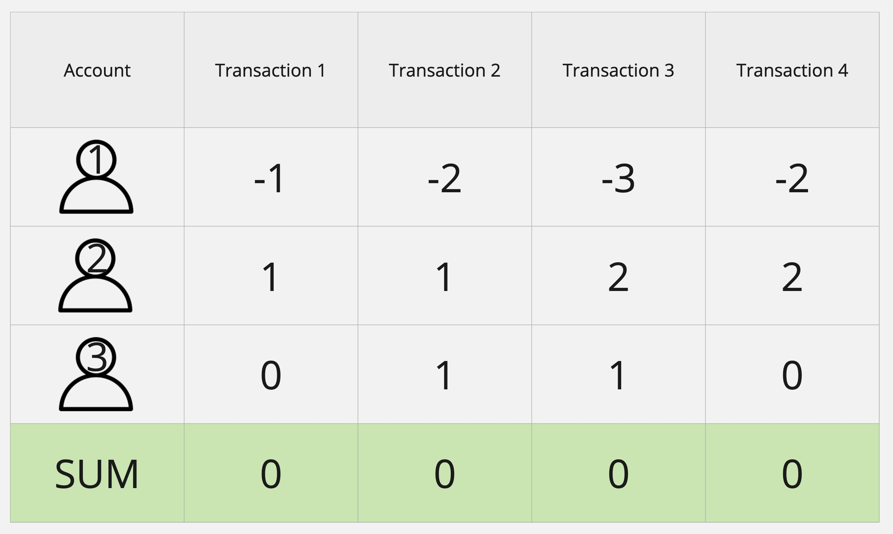

# Ch 6 - Consistency

Consistency has become more of a concern as real-time analytics are becoming more popular. Depending on the stream processor you choose, you may get different results. You must know the level of consistency required before choosing.



The diagram shows 3 bank accounts (1,2,3). They all start off with zero balance. Transactions are randomly created that transfers 1 dollar to another account. At any state, the sum of all accounts should be zero. 

The transactions producer in this repository is randomly transferring money between 10 accounts.

## Setup
You will need to setup your environment. These instructions will use `homebrew` on MacOS to run Kafka

```bash
# install kafka
brew install kafka

# start zookeeper and kafka
brew services start zookeeper
brew serivces start kafka

# tail the logs
tail -f /usr/local/var/log/kafka/kafka_output.log

# topic commands
kafka-topics --bootstrap-server localhost:9092 --list
kafka-topics --bootstrap-server localhost:9092 --create --topic transactions_flink --config cleanup.policy=compact
kafka-topics --bootstrap-server localhost:9092 --delete --topic transactions_flink
# bin/kafka-topics --alter --topic my_topic_name --zookeeper my_zookeeper:2181 --config cleanup.policy=compact

# list all running services
brew services list

# to stop all
brew services stop all


```
